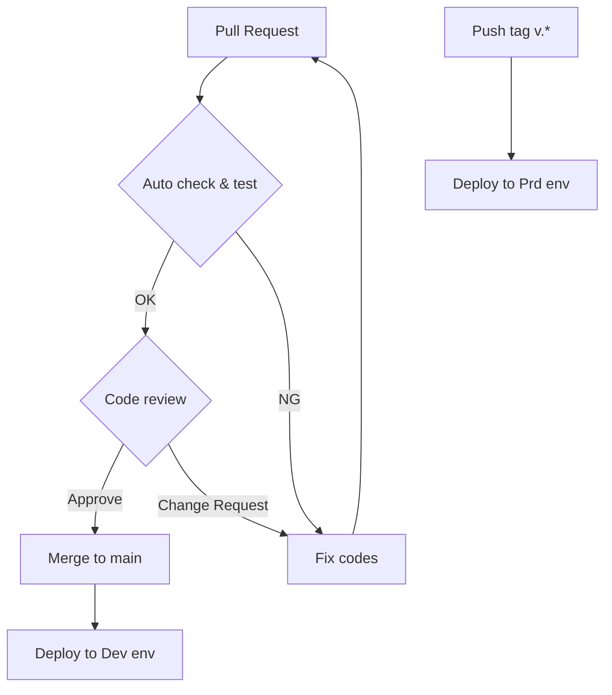
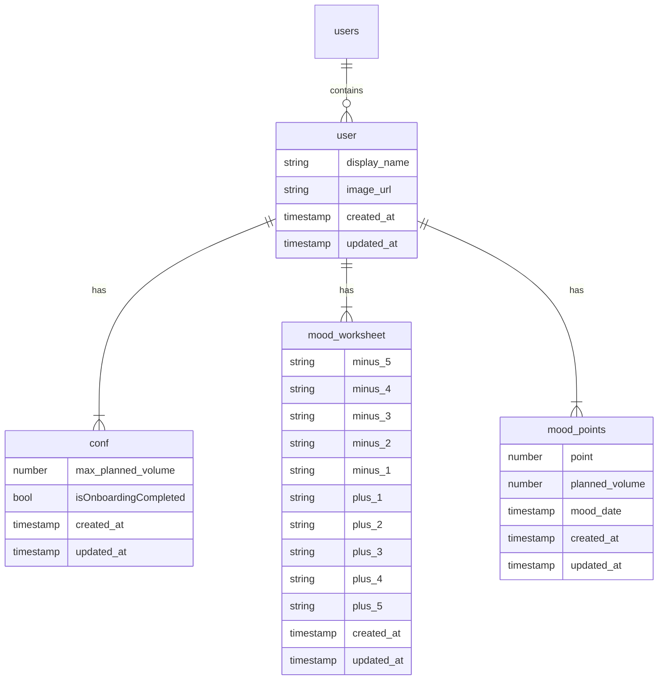

本記事は Flutter 大学アドベントカレンダー 7 日目の記事です。
（空きが出たので急遽参加させていただきました！）

@[card](https://qiita.com/advent-calendar/2023/flutteruniv)

## はじめに

こんにちは、アプリケーション開発を軸とした SRE 領域に興味のある cobo です。

現在、Flutter 大学内の友人と Flutter アプリを開発しています。
そこでは、大きく **Flutter × Firebase** といった比較的馴染みのある技術構成を採用しています。

これら 2 つの技術構成のみで迅速なアプリケーション開発が可能となりますが、
今回は加えて、**プロジェクト管理と運用の効率化**、**セキュリティ面の強化** を意識したアプリケーションアーキテクチャに挑戦してみました。

僕の中では、従来の Flutter × Firebase 構成で大きな課題は感じていなかったものの、**Firebase の特徴を生かすことで、さらにセキュアな構成 かつ プロジェクト管理や運用の効率化が見込めるのでは？** と感じ本挑戦に至りました。

### Firebase の特徴

**Firebase は Google Cloud の一部** です。

そのため、Firebase プロジェクトを作成すると、全く同じプロジェクト名で Google Cloud プロジェクトが自動的に作成されます。

つまり、Firebase の構成を拡張したい場合は、同 Google Cloud プロジェクトのプロダクトを活用すると良いということになります。

## アプリケーションアーキテクチャの紹介

Flutter × Firebase アプリ開発におけるアプリケーション全体としてのアーキテクチャ（以下、アプリケーションアーキテクチャ）を下記に示します。


_現在開発中の Flutter アプリにおけるアーキテクチャの全体像_

## 技術構成の概要

- コード管理
  - GitHub
- CI / CD
  - GitHub Actions
- フロントエンド
  - Flutter
- バックエンド
  - Firebase
- インフラストラクチャ
  - Google Cloud
- IaC (Infrastructure as Code)
  - Terraform
- 脆弱性管理
  - Snyk

### コード管理

@[card](https://github.com/orgs/Mood-Trend/repositories)

下記 4 リポジトリで構成されています。

- フロントエンド
  - Flutter アプリのコード
- バックエンド
  - Firebase Functions のコード
- IaC (Infrastructure as Code)
  - Firebase / Google Cloud のリソース状態を Terraform にて管理するコード
  - Cloud Firestore の Security Rules もこちらで管理している
- 脆弱性管理
  - Firebase / Google Cloud の実リソースとコード状態の差分を検知するためのコード

### CI / CD

冒頭で示したアプリケーションアーキテクチャから抜き出すと下記部分に該当します。
IaC リポジトリ および バックエンドリポジトリが対象です。


_GitHub Actions から Google Cloud (Firebase 含む) へのセキュアな通信_

#### パイプライン

まずは、CI / CD のパイプラインを整理してみます。



- `Pull Request` 作成時
  - CI 実行
    - Firebase Functions フォーマットチェック、静的解析
    - Terraform フォーマットチェック、実行計画
- `main` ブランチマージ時
  - 開発環境に対する CD 実行
    - Firebase Functions デプロイ
    - Terraform 適用
- `tag` 付与時
  - 本番環境に対する CD 実行
    - Firebase Functions デプロイ
    - Terraform 適用

#### Workload Identity 連携の活用

GitHub Actinos と Google Cloud (Firebase 含む) 間で Workload Identity を使用するメリットとして、長期に渡って有効であったサービスアカウントキーに代わって、短時間で有効期限が切れるトークンを利用する点が挙げられます。

これにより、セキュリティリスクを大幅に減少させることができます。

GitHub Actions は Google Cloud、Firebase のリソースにアクセスする際に、外部の ID プロバイダから得たトークンを使って、Google Cloud の短期アクセストークンと交換して、セキュアに認証を行うことができます。

@[card](https://cloud.google.com/blog/ja/products/identity-security/enabling-keyless-authentication-from-github-actions)

:::details GitHub Actions Workflows 側のコード例

```yaml:cd_dev.yaml
name: CD Development
on:
  push:
    branches:
      - main
jobs:
  deploy_functions:
    name: Deploy Functions
    runs-on: ubuntu-latest
    permissions:
      id-token: write
      contents: read
    timeout-minutes: 60
    env:
      PROJECT_ID: ${{ secrets.PROJECT_ID_DEV }}
      WORKLOAD_IDENTITY_PROVIDER: ${{ secrets.WORKLOAD_IDENTITY_PROVIDER_DEV }}
      SERVICE_ACCOUNT: ${{ secrets.SERVICE_ACCOUNT_DEV }}
    steps:
      - name: Check out repository
        uses: actions/checkout@v2
      - name: "Authenticate to Google Cloud"
        uses: "google-github-actions/auth@v1"
        with:
          workload_identity_provider: ${{ env.WORKLOAD_IDENTITY_PROVIDER }}
          service_account: ${{ env.SERVICE_ACCOUNT }}
          create_credentials_file: true
          export_environment_variables: true
      - name: Setup node
        uses: actions/setup-node@v1
        with:
          node-version: 18
      - name: Install Dependencies
        run: npm install
        working-directory: ./functions
      - name: Deploy to Functions
        run: |
          npm install -g firebase-tools
          firebase deploy --only functions --force --project=${{ env.PROJECT_ID }}
```

:::

### フロントエンド / バックエンド

こちらはとてもシンプルな構成となっています。


_モバイルフロント: Flutter, バックエンド: Firebase_

#### Flutter

##### フロントエンドアーキテクチャ


_MVC をベースとした 3 層レイヤードアーキテクチャ_

比較的シンプルな機能なので 3 層で十分かと思っていましたが、やはり Presentation 層内のイベントハンドラが肥大化しつつあるので、Application 層 を別途定義しようかなとも思っています。

ですが、一旦リリースまではこのままでいこうと思います。

#### Firebase

下記 3 プロダクトのみで構成されています。

##### Firebase Authentication


_匿名認証_

##### Cloud Firestore

アプリのデータ管理に使用しています。
:::details Firestore 設計例



:::

##### Cloud Functions

アプリユーザーの追加 / 削除によって起動する関数を定義しています。

- 追加時
  - 該当ユーザーに紐づく Firestore 上のデフォルトのアプリデータの追加
- 削除時
  - 該当ユーザーに紐づく Firesotre 上のアプリデータ削除

### インフラストラクチャ / IaC (Infrastructure as Code)


_Terraform によって Google Cloud と Firebase 環境をコード管理するイメージ_

直接コンソール上から値を変更できるのは、便利ではありますが、意図しない変更によりエラーを招いてしまう可能性があります。

この課題を解決するために Terraform によるインフラ環境のコード管理を導入しました。

#### Terraform の概要

Terraform は、Google Cloud や Firebase などのクラウドプロバイダーのインフラストラクチャの状態をコードとして表現することで、バージョン管理、共有、再利用が容易なインフラを可能にします。

例えば、開発、ステージング、本番環境などの複数環境での設定差異を最小化することで、コンソールからの手作業による予期せぬエラーを防ぐこともできます。

Firebase での環境構築をイメージすると、必要な環境分コンソール上から

- プロジェクト名の入力が必要
- Firebase Authentication のプロバイダーの有効化が必要
- Cloud Firestore にマスタデータの登録が必要（サブコレクションになっていたりするととても面倒。さらに入力ミスが発生しやすい）

などが考えられますよね。

これらをコードで共通化することで、どの環境にも一貫性を持った状態で適用することができます。

```hcl:IAM 関連のコード共通化例
resource "google_project_iam_member" "owner_cobo" {
  project = var.project_id
  role    = "roles/owner"
  member  = "user:${var.gcp_principal_cobo}"
}

resource "google_project_iam_member" "snyk_scan_cloudasset_editor" {
  project = var.project_id
  role    = "roles/cloudasset.viewer"
  member  = "serviceAccount:snyk-scan@${var.project_id}.iam.gserviceaccount.com"
}

resource "google_project_iam_member" "cloud_scheduler_snyk_scan_cloudbuild_builds_builder" {
  project = var.project_id
  role    = "roles/cloudbuild.builds.builder"
  member  = "serviceAccount:cloud-scheduler-snyk-scan@${var.project_id}.iam.gserviceaccount.com"
}
```

:::message
なお、Terraform の CI / CD パイプラインも、上記 [Workload Identity 連携](#ci-%2F-cd) を行って、GitHub Actions から Google Cloud や Firebase に対するセキュアなアクセスをしています。
:::

### 脆弱性管理


_意図しないリソース変更を検知するための仕組み_

Snyk に入る前に Terraform でのリソース状態管理の方法について確認しましょう。

#### Terraform リソースの状態管理

- `.tf` ファイルでリソースをコード化
- `.tfstate` ファイルでリソースの状態を保持
- `terraform plan` or `terraform apply` 実行時のリソース差分検出で、`.tf` ファイルと `.tfstate` ファイル を比較している

そのため、

**実際の Google Cloud や Firebase プロジェクトに対して、意図しないリソース変更が発生した場合に検知が難しい**

といった課題が挙げられます。
例）IaC 化がルールのプロジェクトにおいて、リソースを手で追加してしまう、悪意を持った人が大量のリソースを追加、変更、削除してしまう、Firewall 設定を変更されてしまいそれに気付けない 等

このような課題を解決するために、**Snyk IaC** を活用していきます。

Snyk IaC を活用することで実際の環境とコードでの比較ができるようになるので、意図しないリソース変更を検知することが可能となります。

今回のアプリでは、毎日午前 3:00 に Snyk IaC のスキャンを実行してその結果を Cloud Logging に書き出すようにしています。
ちなみに、現在の IaC カバレッジは 95 % のようです。


_Cloud Logging のログの一部_

いずれはアラートの発報まで実装できたらいいなと思っています。

こちらの Snyk IaC に関する記事は Snyk 社のアドベントカレンダーでも書いたので、興味のある方はそちらも見て頂けると嬉しいです！

@[card](https://zenn.dev/nozomi_cobo/articles/snyk-iac-google-cloud)

## まとめ


- Firebase プロジェクトを作成すると、全く同じプロジェクト名で Google Cloud プロジェクトも作成される
- GitHub Actions -> Google Cloud や Firebase へのセキュアなアクセスの方法として Workload Identity 連携を活用する
- 意図しないリソース変更によるエラーを防ぐため Terraform を活用する
- 意図しないリソース検知には Snyk を活用する

---

技術的な挑戦ができたことで、自身の技術領域が少しだけ広がった気がしました。

リリースはまだですが、リリース後の運用を意識して、アプリケーション全体の設計をしていきたいと思います。

最後まで読んでいただきありがとうございました！！
